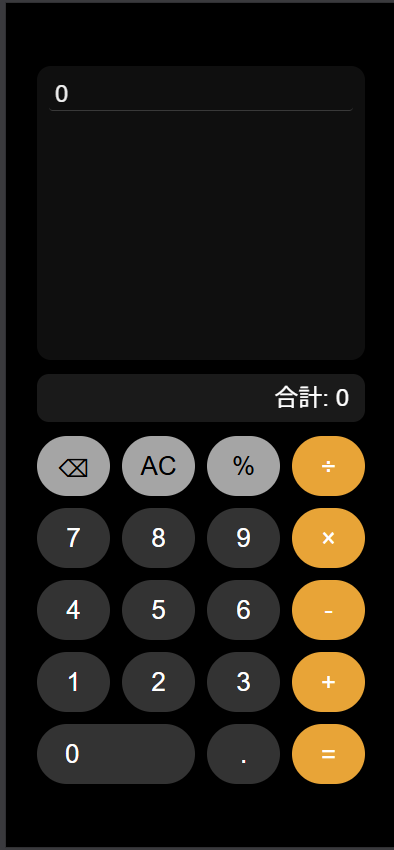
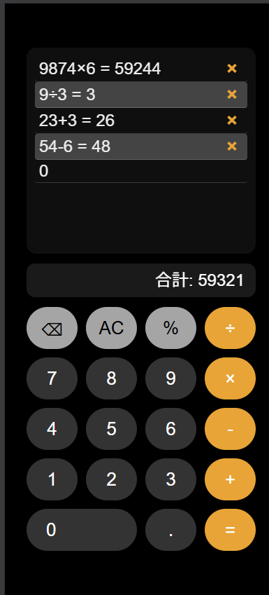

# 履歴付き 電卓 PWA  
iPhone風の洗練された UI と、履歴の見やすさ・操作性を重視したシンプルな電卓アプリです。  
黒・白・オレンジの3色で統一したミニマルなデザインと、PWA対応によるホーム画面インストールをサポートしています。

---

## 📸 スクリーンショット

### ホーム画面アイコン
アプリをインストールした際に表示される iPhone風アイコン。

---

### メイン画面（電卓UI）
黒背景に白・オレンジの記号を配置した、視認性の高いミニマルな電卓画面。

---

### 履歴表示
計算履歴が縦に並び、削除ボタン付きで管理しやすい構成。  
合計値も自動で表示されます。

---

### PWA インストール画面
ホーム画面に追加する際のインストール UI。

---

## ✨ 特徴

### ■ iPhone風の洗練されたデザイン
- 黒背景に白・オレンジの記号を配置した 2×2 アイコン  
- 記号は最大サイズで視認性を確保  
- 余白を極力排除したミニマルな構成

### ■ 基本的な電卓機能
- 四則演算（＋ − × ÷）
- 連続計算に対応
- クリア（C）・オールクリア（AC）

### ■ 履歴機能
- 計算ごとに履歴を追加  
- 履歴の削除ボタン付き  
- 合計値を自動表示  
- 見やすい縦リスト形式

### ■ UI/UX
- ボタンに Ripple エフェクト  
- 押した感がわかる視覚フィードバック  
- iPhone標準アプリに近い操作感

### ■ PWA 対応
- ホーム画面に追加可能  
- オフライン動作  
- `manifest.json` と `service-worker.js` を実装  
- アイコンは 192px / 512px を用意

---

## 📁 ファイル構成

# 履歴付き 電卓 PWA  
iPhone風の洗練された UI と、履歴の見やすさ・操作性を重視したシンプルな電卓アプリです。  
黒・白・オレンジの3色で統一したミニマルなデザインと、PWA対応によるホーム画面インストールをサポートしています。

---

## 📸 スクリーンショット

### ホーム画面アイコン
アプリをインストールした際に表示される iPhone風アイコン。

---

### メイン画面（電卓UI）
黒背景に白・オレンジの記号を配置した、視認性の高いミニマルな電卓画面。

---

### 履歴表示
計算履歴が縦に並び、削除ボタン付きで管理しやすい構成。  
合計値も自動で表示されます。

---

### PWA インストール画面
ホーム画面に追加する際のインストール UI。

---

## ✨ 特徴

### ■ iPhone風の洗練されたデザイン
- 黒背景に白・オレンジの記号を配置した 2×2 アイコン  
- 記号は最大サイズで視認性を確保  
- 余白を極力排除したミニマルな構成

### ■ 基本的な電卓機能
- 四則演算（＋ − × ÷）
- 連続計算に対応
- クリア（C）・オールクリア（AC）

### ■ 履歴機能
- 計算ごとに履歴を追加  
- 履歴の削除ボタン付き  
- 合計値を自動表示  
- 見やすい縦リスト形式

### ■ UI/UX
- ボタンに Ripple エフェクト  
- 押した感がわかる視覚フィードバック  
- iPhone標準アプリに近い操作感

### ■ PWA 対応
- ホーム画面に追加可能  
- オフライン動作  
- `manifest.json` と `service-worker.js` を実装  
- アイコンは 192px / 512px を用意

---

## 📁 ファイル構成


/calculator-pwa/ 
├─ index.html              # 電卓本体 
├─ manifest.json           # PWA設定 
├─ service-worker.js       # キャッシュ制御 
├─ icons/ 
│   ├─ icon-192.png 
│   └─ icon-512.png 
├─ docs/ 
│   └─ screenshots/ 
│        ├─ icon.png 
│        ├─ main-ui.png 
│        ├─ history.png 
│        └─ pwa-install.png 
└─ README.md               # このファイル

---

## 🎨 アイコン仕様

- 色：黒 (#000000) / 白 (#FFFFFF) / オレンジ (#FF9500)
- 配置：2×2 グリッド  
  - 左上：＋（オレンジ）  
  - 右上：−（白）  
  - 左下：×（白）  
  - 右下：＝（オレンジ）  
- 角丸のスクエア（iPhoneアプリアイコン風）
- 記号は可能な限り大きく配置

---

## 🧩 今後の改善アイデア（ToDo）

- 履歴の永続化（localStorage）
- 履歴の CSV / JSON 出力
- テーマ切り替え（ライト / ダーク）
- 記号の色カスタマイズ
- キーボード入力対応
- 計算履歴の検索機能

---

## 🕒 バージョン履歴（CHANGELOG）

### v1.0
- 電卓の基本機能を実装  
- 履歴表示・合計表示を追加  
- Ripple エフェクトを実装  
- PWA 対応（manifest / SW）
- 黒・白・オレンジの3色で統一  
- 記号サイズを最大化

---

## 📦 ライセンス
このプロジェクトは自由に改変・利用できます。

